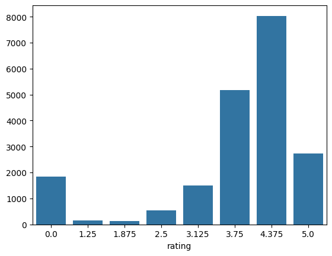
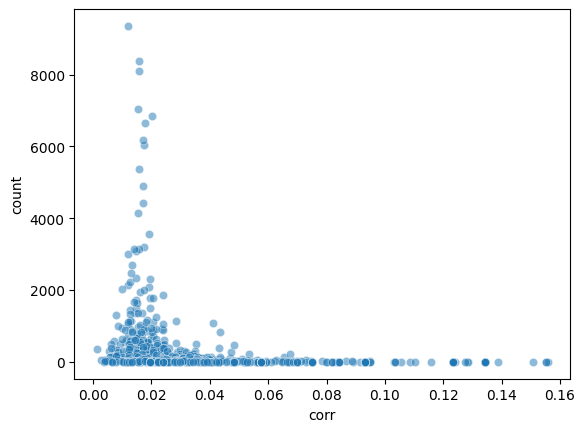
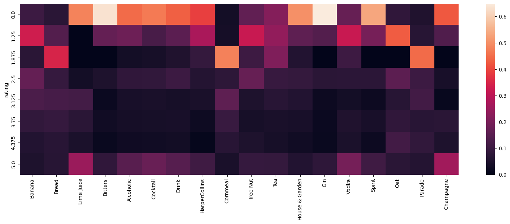
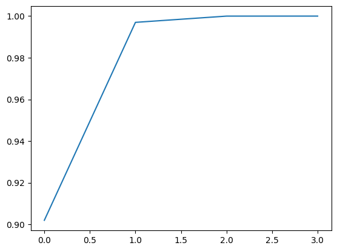
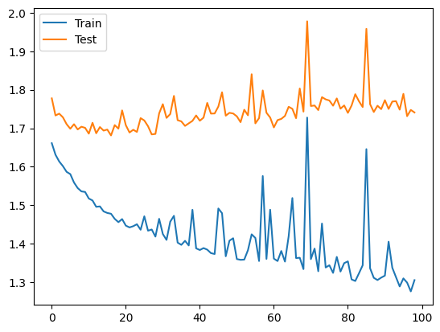
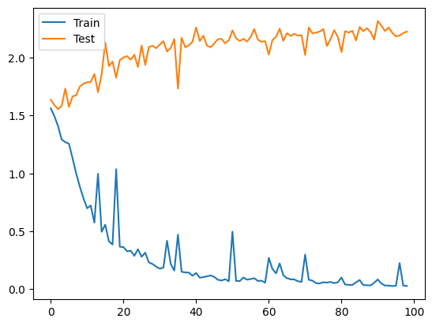
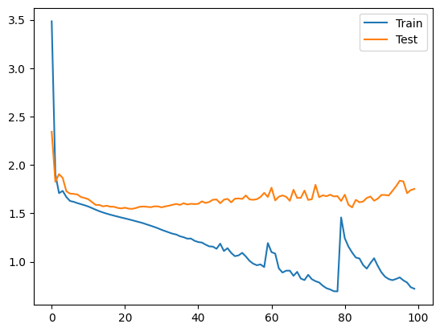
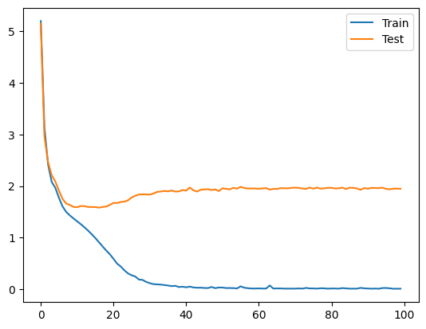
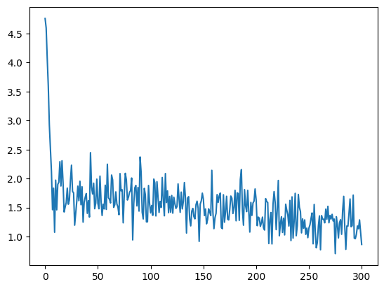

# DataProcessingFinalProject

## The Problem
We have a recipe dataset with columns like: title, ingredients, directions, etc. We want to predict the rating. Even though the rating is a categorical variable, we will treat it as a regression problem and use only regression models.
It is also interesting to see that the distribution of rating is very skewed.




## Methodology
I splitted the tasks into three parts: 
- preprocessing: Task 3.1 till 3.3
- processing: Task 3.4 till 3.5
- extension: Task 4

## Preprocessing and Analysis
The preprocessing is done in the [preprocessing.ipynb](preprocessing.ipynb) file. 

### Analysis of the categories
There are very many different categories in the dataset. So it is very hard to see by eye which ones could have influence on the rating.
To get an overview of the categories I looked at that diagram:


Every dot is a category. The x axis shows the difference between the mean distribution of the ratings in general and the mean distribution of the ratings in that category. If the difference is high, I expect the correlation between the category and the rating to be high. If the difference is low that means the category is not very informative. The y axis shows the count of the category. Categories with a high correlation, but a low count are not very significant.
I want to look at the categories with a high count and a high correlation:


One can see that for example the category "Alcoholic" has a high number of 0 ratings and a low number of 4.375 ratings. This means that the category "Alcoholic" is very informative for the rating and if we see a recipe with the category "Alcoholic" we can expect a lower rating.
The category "Champagne" seems to be pretty polarizing. There are a lot of 0 ratings and a lot of 5 ratings. This means that the category "Champagne" is very informative for the rating and if we see a recipe with the category "Champagne" we can expect either a very high or a very low rating.

I also did a PCA on the numerical columns to if one could reduce the dimensionality of the dataset. 


The PCA showed that the first two components already explain 99% of the variance. This is why I reduced the dimensionality of the dataset to two dimensions and still have a good representation of the data.

### General preprocessing
I decided to first remove all punctuation and digits since the punctuation does not give any big additional meaning and I also expect number to not be very infuencial on the rating. More important is the general meaning and content of the text.
For tfidf and word2vec it is important to not have too many different words, because otherwise the dimensionality of tfidf will be too big and the word2vec model will not generalize well. This is why I also removed all stopwords and made all words lowercase. Additionally I lemmatized all words to get the root of the word and to further reduce the dimensionality of the dataset.

### tfidf
Tfidf is done on the combination of the following columns: title, description and directions. I decided to add the column title because I think the title of a recipe is very important for the rating.

### word2vec
The same is done for word2vec. I averaged the word2vec embeddings of the title, description and directions over all embedding vectors to reduce the dimensionality of the data to be one dimensional. Otherwise we would have a matrix instead of a vector and a huge amount of data with few additional information.

### Context embedding with transformer based models
I used the basic uncased bert model from huggingface for the context embedding. Again I used the combination of the columns title, description and directions. I again averaged the embeddings over all vectors to get a one dimensional vector, because of the same reasons as for word2vec.

## Processing
### Baseline
The baseline is just the mean of the ratings. The mse of the baseline is 1.8. So the mean error is around 1.3, which is not very good given that the ratings are between 0 and 5, showing that there should be room for improvement.

### Neural Network
We will use a neural network with a combination of linear, relu and dropout.
As data I tried using the encodings without meta data and with meta data like the number of steps in the directions or the number of ingredients. In general the results I got from the model with the meta data were better, I think this is because the meta data gives the model additional information about the recipe, that can be important for the rating, which are not encoded in the content of the textual columns. This is why I decided to use the meta data for the final models. 

layers. Data: word2vec, linear layers: input_size -> input_size/2 -> 256 -> 128 -> 1


Data: word2vec, linear layers: input_size -> input_size/2 -> 256 -> 128 ->8 -> 1


I tried different combinations of layers. For me it was beneficial to have the first layer with half of the input size and then decrease the size of the layers. the input size is from about 1500 for tfidf to 500 for word2vec. Another idea was to have a layer with 8 neurons before the output layer, so the neural network can learn the single classes of ratings better, but as seen in the results this did not improve the performance.

Data: word_embedding, linear layers: input_size -> input_size/2 -> 256 -> 128 -> 8 -> 1


The word embeddings performed way better than the other methods. As seen in the results the test mse is around 1.5 in the beginning, but the model overfits very fast. 
This is why i decided to decrese the model complexity for example by decreasing the number of neurons in the layers and reducing the number of layers. An example of a model that performed well is the following:

Data: word_embedding, linear layers: input_size -> input_size/2 -> 256 -> 128 -> 1


Around epoch 20 the model is best and from there on the model overfits. Best mse I could reach was: 1.5617

I also trained NNs with the tfidf encoding, but I dont expect them to perform very well, so I did not try to tune the NN parameters for tfidf.
Here is an example of a model with tfidf encoding and the NN that worked best for the word embeddings:


### Other techniques
I decided to first try a RandomForrest model. At first the model performed quite well with a mse of 1.6 on the numerical columns, but when trying to add the encodings from the previous task, the model takes forever to train. This is probably because of the nature of the RandomForrest models. 
This is why I decided to try differnt models. E.g.: SVM
This in the result of one run of the SVM models with different data:

SVR() with interesting_columns
-- Mean MSE: 1.8940360241305583
-- Compared to baseline mse: 95%
SVR() with tfidf
-- Mean MSE: 1.585610046398831
-- Compared to baseline mse: 114%
SVR() with word2vec
-- Mean MSE: 1.8879442238406843
-- Compared to baseline mse: 96%
SVR() with context_embedding
-- Mean MSE: 1.705611466709691
-- Compared to baseline mse: 106%

The SVM models did not take as long to train and gave good results. The best results I got where with the tfidf encoding. I can only guess that the tfidf encoding is the best because classical machine learning models like SVM are better suited for dummy encoded data than for the word embeddings. 
Results for GradientBoosting models:

GradientBoostingRegressor() with interesting_columns
-- Mean MSE: 1.6609051640225028
-- Compared to baseline mse: 109%
GradientBoostingRegressor() with tfidf
-- Mean MSE: 1.5411751709753745
-- Compared to baseline mse: 117%
GradientBoostingRegressor() with word2vec
-- Mean MSE: 1.681350425842794
-- Compared to baseline mse: 107%
GradientBoostingRegressor() with context_embedding
-- Mean MSE: 1.5304366199453243
-- Compared to baseline mse: 118%

The GradientBoosting models performed even better than the SVM models. The best results I got where with the context embedding. I think this is because the context embedding is the most informative for the rating and the GradientBoosting model can make use of this information the best.

To conclude the best model I got so far was a GradientBoosting model with the tfidf encoding and a mse of 1.53.

### Fine tuning a transformer based model with a regression head
I again used the bert-base-uncased model, but this time with number of labels set to 1 so we can do the regression task later. 
Since transformers work very well on text data and they don't need special preprocessing like word2vec or tfidf, I used as train data the raw directions column. Why did I only use the directions column? 
I expect the directions column to be the most informative for the rating and since I set the max_length to 128 to have faster training. The directions column is most of the time already longer than 128 tokens, which is why there is no need to add the title and description column, since they would be cut off anyway.

This is one typical example run one of the transormer training.



One can see that the training mse is decreasing steadily going under 1, which doesn't say anything about the test mse.
The best test mse optained was 1.527 which shows that running the transfomer even longer would only lead to overfitting, so there is no need to further train the model.

I expect the results to be even better, when increasing the max_length of the model and also using title and description as input data, sadly I could not do this because of the gpu usage limits.

### Conclusion
I total the best results I could get was the one of the finetuned transformer model with a mse of 1.527. This shows the power of transformer based models on text data, especially when comparing this with the results of the other models. 
In general I still think that a mse of around 1.5 is not very good given that the baseline is already 1.8. This shows that the rating is a very hard task to predict. 

# Extension
## The problem
Cooking with Leftover Food - If there is leftover ingredients a user wants to enter the ingredients and get a meal and recipe for that meal.

This is done with a openSource model called llama from with the free API provider called Groq.
The training is already done for this model so the most important part is to test different prompts to get the best results.
The model is a general purpose model, which is why we need to tell it in the prompt what we are doing. 
To process the response from the API we tell the model to wrapp the actuall content in a json object, so we can easily access the content. Those models tend to add first sentences like: "Here is a recipe for you: " or "I found a recipe for you: " which is why we need to remove those sentences from the response and wrap the actuall content in ```.
The results sound very good, but if its really eatable in the end is a question of the random ingredients i guess.

We compared that to the results of locally running a transfomer model by google (t5-small). The results here are not really doing what we want, because the model is not trained on this task. The results are more like a transalation from english to english than the answer to our problem. Also tried training of a local model on the data was tried, but not successful.


